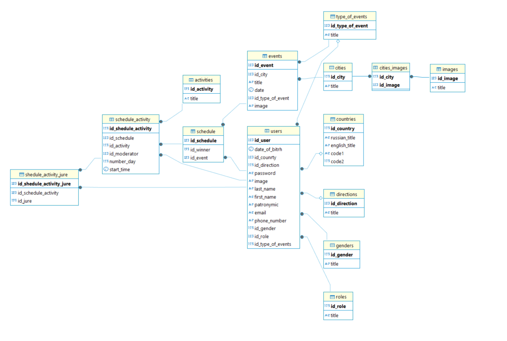

# Конференции по информационной безопасности

Программное обеспечение «Конференции по информационной безопасности» предназначена для организаторов конференций по информационной безопасности.

## Папки

| База данных | Скрипт для создания и заполнения базы данных|
| ----------- | ----------- |
| Библеотека   | DLL для работы с автомобильными номерами и unit tests  |
| Десктоп   | Проект десктопного приложения «Конференции по информационной безопасности» |
| Документация   | DataDictionary, диаграмма прецендентов, руководство пользователя, ручное тестирование|

## Советы по установке

1. Клонируйте репозиторий

2. Создайте базу данных в DBeaver

3. Откройте редактор SQL  и вставьте скрипт из файла создание_таблиц.txt из папки База данных

4. После создания таблиц вставьте скрипт из файла заполнение_данными.sql из папки База данных

5. Откройте проект из папки Десктоп в IDE

6. В файле StudingContext.cs в строке 

```bash

protected override void OnConfiguring(DbContextOptionsBuilder optionsBuilder)
#warning To protect potentially sensitive information in your connection string, you should move it out of source code. You can avoid scaffolding the connection string by using the Name= syntax to read it from configuration - see https://go.microsoft.com/fwlink/?linkid=2131148. For more guidance on storing connection strings, see https://go.microsoft.com/fwlink/?LinkId=723263.
        => optionsBuilder.UseNpgsql("Host=localhost;Port=5432;Username=postgres;Password=12345;Database=studing;");

```

Username, Password, Database поменять на данные своей базы

## Отчет по дням

### День 1

Была создана база данных и импортированны данные



### День 2

Написан словарь данных таблиц базы данных и создана диаграмма прецендентов


### День 3

Созадана общественная часть приложения и авторизация


### День 4

Создана страница регистрации жюри/модератора


### День 5

Создана библеотека методов для проверки автомобильных номеров, автоматизированные тесты к эти методам, разработаны тест кейсы для регистрации жюри/модератора, сделано руководство пользователя, собраны все результаты в один репозиторий

